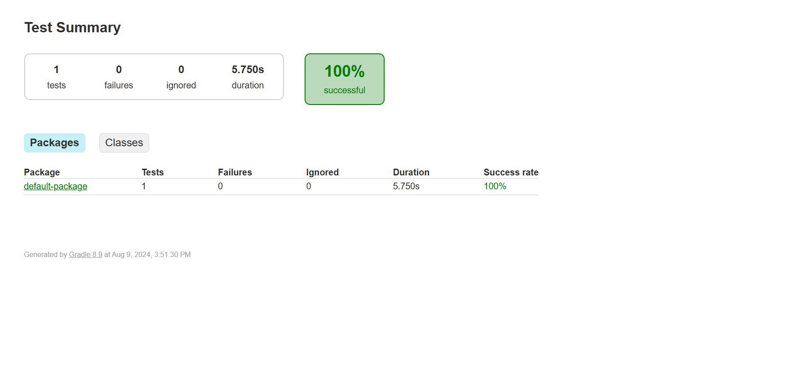

# Web Site Automation using Junit
This project uses Selenium WebDriver with Node.js to interact with the Guest Registration Form(https://demo.wpeverest.com/user-registration/guest-registration-form/). The script fills in necessary fields, submits the form, and verifies the success message upon successful registration.

## Prerequisites

- [Node.js](https://nodejs.org/en/) installed
- [npm](https://www.npmjs.com/) (comes with Node.js)
- [ChromeDriver](http://chromedriver.chromium.org/downloads) (ensure it matches your Chrome version)
- [Selenium WebDriver](https://www.selenium.dev/) (can be installed via npm)

## Installation

1. Clone the repository:
   ```bash
   git clone https://github.com/yourusername/webform-automation.git
   cd webform-automation

## Overview
This project automates the submission of a registration form for the Guest Registration Form. The automation script fills out required fields, submits the form, and verifies the success of the registration process.

## Key Features
- **Automated Form Submission**:Navigate to the registration form URL and fill out required fields programmatically.
- **Field Inputs**:Inputs values for Firstname, Lastname, UserEmail, Gender, Date of Birth, Nationality, Phone, Country (Bangladesh), and agrees to the Terms & Conditions.
- **Success Message Verification**:he script waits for and verifies the appearance of the success message indicating that registration was successful.
- **Logging**: Console logs indicate whether the form submission was successful or if any errors occurred during the process.

## Purpose
The primary purpose of this project is to demonstrate automated testing capabilities using Selenium WebDriver and Node.js. By automating the web form submission, it showcases how repetitive manual tasks can be efficiently handled through script automation, ensuring accuracy and reliability in testing scenarios.

## Goals


- **Efficiency**: Reduce manual effort and time involved in testing form submission processes.
  
- **Reliability**: Ensure consistent and reproducible results in form submission testing.
  
- **Demonstration**: Serve as a practical example of using Selenium WebDriver for web automation tasks.


## Results
# report Picture

